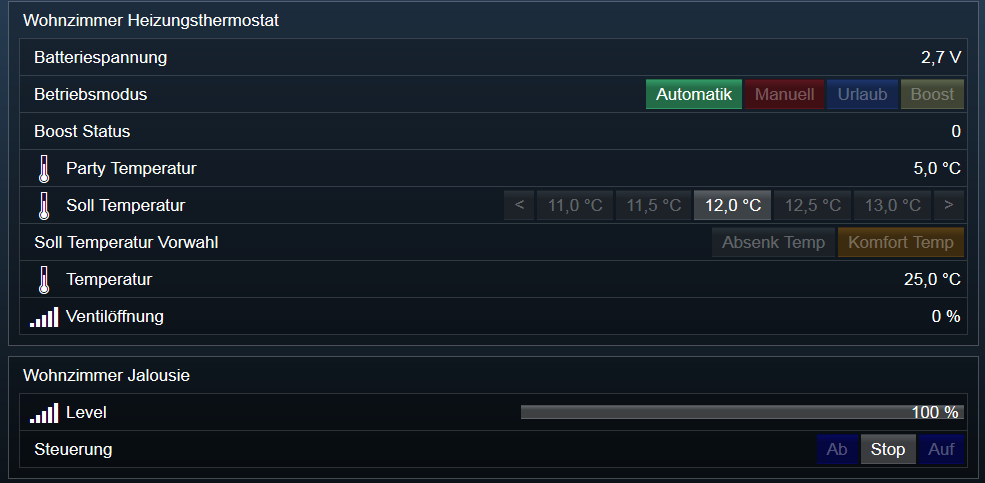
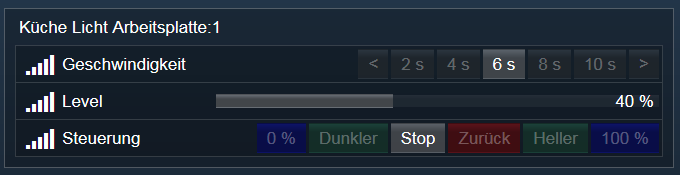

# HomeMatic-EasyInstall
**Version 1.50**  

## Inhaltsverzeichniss

1. [Funktionsumfang](#1-funktionsumfang)  
2. [Voraussetzungen](#2-voraussetzungen)  
3. [Installation](#3-verwendung)  
4. [Mapping](#4-mapping)  
5. [Screenshots](#5-screenshots)  
6. [Anhang](#6-anhang)  

## 1. Funktionsumfang

Unterstützt bei der Ersteinrichtung oder Erweiterung von Homematic-Geräten in IPS.  

**Details:**

* Es werden alle noch nicht in IPS eingerichteten Homematic-Instanzen angelegt.  
* Alle Geräte werden nach Räumen sortiert.  
* Geräte welche in der CCU einem Gewerk zugeordnet sind, werden verlinkt.  
* Alle Geräte erhalten den Namen aus der CCU.  
* Die Statusvariblen und deren Links werden nach einem zu definierenden Mapping benamst.  
* Nicht benötigte Statusvariablen werden automatisch ausgeblendet.  
* Den Statusvariblen werden entsprechende Profile zugeordnet.  
* Besondere Geräte und ihre Statusvariblen erhalten außerdem ein Aktions-Skript. [Siehe Screenshots] (#5-screenshots)  
* Es werden zusätzliche Variablen für einfach Bedienung aus dem WebFront erzeugt. [Siehe Screenshots] (#5-screenshots)  
* Es wird versucht der aktuelle Wert der Statusvariablen von der CCU abzufragen.
* Die Verwendung von mehreren CCU's ist möglich.

## 2. Voraussetzungen:

* CCU1 oder CCU2  
* min. IPS Pro (es werden jede Menge Variablen angelegt)  
* Die Geräte müssen in der CCU nach Räumen geordnet sein. Diese Strucktur wird in IPS nachgebildet. Es wird jedoch nur ein Raum pro Gerät unterstützt.  
* Die Geräte sollten in der CCU nach Gewerken sortiert sein. Diese Strucktur wird in IPS mit Links nachgebildet.  
* Firewall in der CCU muss so konfiguriert sein, das IPS Zugriff auf die ReGa HSS Logikschicht hat.
* Je CCU muss auf dem IPS System eine eventuelle Firewall so eingerichtet werden, dass die CCU IPS auf den Port 5544 (fortlaufend für jede CCU ein Port) erreichen kann.  
* Alle Bezeichnungen in der CCU dürfen keines der folgenden Zeichen enthalten: <, >, ', ", &, $, [, ], {, } und \  Dies ist aber schon Vorgabe von der CCU ! Wer es dennoch schafft solche Zeichen einzugeben, muss mit Fehlern (auch auf der CCU!) rechnen.

## 3. Verwendung:

* Inhalt von der Datei Script.php in ein neues leeres Script von IPS einfügen.
* Es muss wenigstens im Abschnitt Konfiguration eine CCU eingetragen werden.  
* Zusätzliche Einstellungen sind jeweils seperat im Script beschrieben.  
* Das Script ausführen.  

**Hinweise:**    
 Ist ein Homematic-Socket mit der unter 'Konfiguration' angegeben IP-Adresse oder Namen nicht vorhanden, so wird er automatisch angelegt.  
 Sollte das Script mit einem Fehler beendet werden; einfach noch mal ausführen. Bereits angelegte Geräte werden übersprungen!  

## 4. Mapping:
 Aktuell enthält das Mapping alle bekannten Geräte- und Kanal-Typen.  
 Entsprechende Profile und Aktionen wurden schon in den Index-Feldern 'Profil' und 'Action' vorgegeben.  
 Die Benamung der Variablen erfolgt anhand der Index-Felder 'Name Raum' und 'Name Gewerk'.  
 In Diesen Feldern stehen auch Platzhalter für dynamische Namen zur Verfügung:  

   * %1$s = Name vom Gerät  
   * %2$s = Name vom Raum  
   * %3$s = Name vom Gewerk (Aktuell nur im Index 'Name Gewerk' verfügbar)  

## 5. Screenshots:

  
  

## 6. Anhang:

   **Changelog:**  

   **Version 1.2:**  

   Neu:  

   * Mehr Profile (Neue Wand & Heizkörperthermostaten, BLIND-Geräte)  
   * Zuätzliche Variablen und Aktions-Scripte für die einfache Bedienung von bestimmen Geräten implementiert:  

       - Neue Wand & Heizkörperthermostaten  
       - BLIND-Geräte (Jalousie-Aktoren)  

   BugFix:  

   * Die neuen Wand & Heizkörperthermostaten senden einige Statusvariablen erst nach einiger Zeit oder wenn der Modus umgeschaltet wurde.  
   * Ein neues Feld 'forceDP' im Mapping-Array erzwingt jetzt das Anlegen von Statusvariablen und fragt anschließend den Wert aus der CCU ab.  

   **Version 1.4:**  

   Neu:  

   * Zuätzliche Variablen und Aktions-Scripte für die einfache Bedienung  von bestimmen Geräten implementiert:  

    - DIMMER  
    - VIRTUAL_DIMMER  

   BugFix:  

   * Alle veralteten IPS_* PHP-Funktionen entfernt.  
   * Kleiner Anpassungen, damit das Script auf IPS 4.x besser läuft.  

   **Version 1.45:**  

   BugFix:  

   * Enthält ein Kanal oder Gerät ein < oder > Zeichen im Namen, schlug das Laden der Daten von der CCU fehl.  

   **Version 1.46:**  

   BugFix:  

   * Wired-Geräte wurden bei der CCU2 nicht immer erkannt und angelegt.  

   **Version 1.47:**

   Neu:  

   * Folgende Geräte-Typen ergänzt:  

    - RAINDETECTOR  
    - RAINDETECTOR_HEAT  
    - PULSE_SENSOR  
    - TILT_SENSOR  
    - DIGITAL_OUTPUT  
    - CAPACITIVE_FILLING_LEVEL_SENSOR  
    - DIGITAL_ANALOG_OUTPUT (Profil für FREQUENCY fehlt noch)  
    - DIGITAL_INPUT (Profil für FREQUENCY fehlt noch)  
    - DIGITAL_ANALOG_INPUT (Profil für VALUE fehlt noch)  
    - INPUT_OUTPUT  
    - POWERMETER_IGL (Alle Profile fehlen noch)  
    - STATUS_INDICATOR (Alle Profile fehlen noch)  
    - KEYMATIC (Alle Profile fehlen noch)  
    - SENSOR_FOR_CARBON_DIOXIDE (Alle Profile fehlen noch)  
    - ALARMACTUATOR (Alle Profile fehlen noch)  
    - WINMATIC (Alle Profile fehlen noch)  
    - AKKU (Alle Profile fehlen noch)  
    - WATERDETECTIONSENSOR (Profil für STATE fehlt noch)  

   * Folgende Kanal-Typen für bestehende Geräte-Typen ergänzt:  

    - AIR_PRESSURE  (Profil fehlt noch)

   **Version 1.48:**

   BugFix:  

   * CURL-Sendet einen Header welche die CCU nicht unterstützt.

   **Version 1.50:**

   BugFix:  

   * Es wurden Variablen falsch benannt und Fehler im Script erzeugt, wenn das Mapping unvollständig war (z.B. die ganzen TODO Einträge)   

   Neu:  

   * Homematic-IP wird unterstützt (sofern IPS-Version paßt !)  
   * Verlinkung auf Gewerke (GewerkCat) kann deaktiviert werden.  
   * Erstellen von Hilfsvariablen und angepaßten Aktions-Scripten kann deaktiviert werden. (ScriptCat)  

